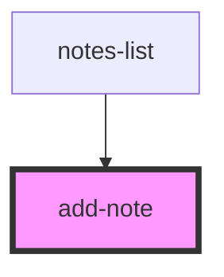

# add-note

<!-- Auto Generated Below -->

## Properties

| Property        | Attribute | Description | Type                     | Default     |
| --------------- | --------- | ----------- | ------------------------ | ----------- |
| `handleAddNote` | --        |             | `(text: string) => void` | `undefined` |

## Dependencies

### Used by

 - [notes-list](../notes-list)

### Graph

----------------------------------------------

*Built with [StencilJS](https://stenciljs.com/)*
