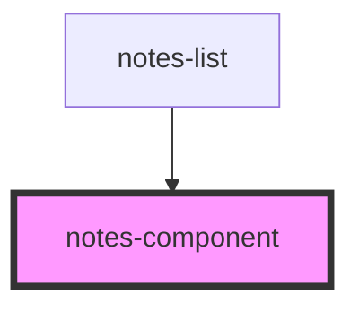

# notes-component

<!-- Auto Generated Below -->

## Properties

| Property       | Attribute | Description | Type                                 | Default     |
| -------------- | --------- | ----------- | ------------------------------------ | ----------- |
| `date`         | `date`    |             | `string`                             | `undefined` |
| `handleDelete` | --        |             | `(id: string) => void`               | `undefined` |
| `handleEdit`   | --        |             | `(id: string, text: string) => void` | `undefined` |
| `id`           | `id`      |             | `string`                             | `undefined` |
| `text`         | `text`    |             | `string`                             | `undefined` |

## Dependencies

### Used by

 - [notes-list](../notes-list)

### Graph

----------------------------------------------

*Built with [StencilJS](https://stenciljs.com/)*
