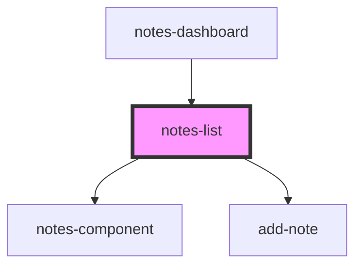

# notes-list

<!-- Auto Generated Below -->

## Properties

| Property        | Attribute | Description | Type                                 | Default     |
| --------------- | --------- | ----------- | ------------------------------------ | ----------- |
| `handleAddNote` | --        |             | `(text: string) => void`             | `undefined` |
| `handleDelete`  | --        |             | `(id: string) => void`               | `undefined` |
| `handleEdit`    | --        |             | `(id: string, text: string) => void` | `undefined` |
| `notes`         | --        |             | `Notes[]`                            | `undefined` |

## Dependencies

### Used by

 - [notes-dashboard](../notes-dashboard)

### Depends on

- [notes-component](../notes-component)
- [add-note](../add-note)

### Graph

----------------------------------------------

*Built with [StencilJS](https://stenciljs.com/)*
